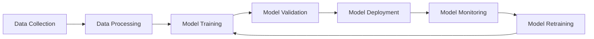

# MLOps Overview
## Knowledge Transfer Session 1

---

## 🎯 Session Objectives

- Understand MLOps fundamentals
- Learn about ML model lifecycle challenges
- Explore our MLOps demo architecture
- See the complete pipeline in action

---

## 📚 What is MLOps?

**MLOps** = Machine Learning + DevOps + Data Engineering

### Traditional ML vs MLOps

| Traditional ML | MLOps |
|---|---|
| Jupyter notebooks | Production pipelines |
| Manual deployments | Automated CI/CD |
| Static models | Continuous monitoring |
| Local development | Scalable infrastructure |

---

## 🔄 ML Model Lifecycle



### Key Challenges

1. **Data Quality & Drift**
2. **Model Performance Degradation**
3. **Scalability & Reliability**
4. **Compliance & Governance**
5. **Team Collaboration**

---

## 🏗 MLOps Architecture Components

### Core Components
- **Data Versioning** (DVC)
- **Experiment Tracking** (MLflow)
- **Model Serving** (FastAPI)
- **Monitoring** (Prometheus + Grafana)
- **CI/CD** (GitHub Actions)
- **Containerization** (Docker)

### Our Demo Stack
```
┌─────────────────┐  ┌─────────────────┐  ┌─────────────────┐
│   Data Layer    │  │  Compute Layer  │  │ Serving Layer   │
│                 │  │                 │  │                 │
│ • DVC           │  │ • MLflow        │  │ • FastAPI       │
│ • Raw Data      │  │ • Training      │  │ • Docker        │
│ • Processed     │  │ • Validation    │  │ • Load Balancer │
└─────────────────┘  └─────────────────┘  └─────────────────┘
```

---

## 🎭 Our Demo: 5 ML Models

### 1. Iris Classification
- **Type**: Multiclass Classification
- **Algorithm**: Random Forest
- **Use Case**: Species prediction from flower measurements

### 2. House Price Prediction
- **Type**: Regression
- **Algorithm**: XGBoost
- **Use Case**: California housing price estimation

### 3. Sentiment Analysis
- **Type**: Text Classification
- **Algorithm**: DistilBERT
- **Use Case**: Product review sentiment

### 4. Customer Churn
- **Type**: Binary Classification
- **Algorithm**: LightGBM
- **Use Case**: Telecom customer retention

### 5. Image Classification
- **Type**: Computer Vision
- **Algorithm**: CNN
- **Use Case**: Color-based image categorization

---

## 🔧 Demo Environment

### Infrastructure
```yaml
Services:
  - API Server (FastAPI)
  - MLflow Tracking Server
  - Prometheus Monitoring
  - Grafana Dashboards
  - Jupyter Notebooks
  - Data Drift Detection
```

### Access Points
- **API Documentation**: http://localhost:8000/docs
- **MLflow UI**: http://localhost:5000
- **Grafana Dashboards**: http://localhost:3000
- **Prometheus Metrics**: http://localhost:9090

---

## 🚀 Live Demo

### What We'll Show

1. **Complete Pipeline Overview**
   - Data versioning with DVC
   - Model training and tracking
   - Automated deployment
   - Real-time monitoring

2. **Model Serving**
   - REST API endpoints
   - Batch predictions
   - Model metadata

3. **Monitoring Dashboard**
   - Request metrics
   - Model performance
   - System health
   - Data drift alerts

---

## 🎯 Benefits of Our MLOps Approach

### For Data Scientists
- ✅ Reproducible experiments
- ✅ Easy model deployment
- ✅ Performance tracking
- ✅ Collaboration tools

### For ML Engineers
- ✅ Automated pipelines
- ✅ Scalable infrastructure
- ✅ Monitoring & alerting
- ✅ Version control

### For Business
- ✅ Faster time-to-market
- ✅ Reliable ML systems
- ✅ Cost optimization
- ✅ Risk mitigation

---

## 📈 MLOps Maturity Levels

### Level 0: Manual Process
- Manual, script-driven process
- Disconnect between ML and operations

### Level 1: ML Pipeline Automation
- Automated training pipeline
- Continuous training of the model

### Level 2: CI/CD Pipeline Automation
- Automated building, testing, and deployment
- Fast and reliable ML pipeline deployment

**Our Demo**: Level 2 Implementation

---

## 🔮 Industry Trends

### Current State
- 87% of ML projects never make it to production
- Average time to deploy: 8-12 months
- Manual processes dominate

### MLOps Adoption
- 📈 Growing investment in ML infrastructure
- 🔧 Standardization of tools and practices
- 🤖 Increasing automation
- 📊 Focus on monitoring and governance

---

## 💡 Key Takeaways

1. **MLOps is Essential** for production ML
2. **Automation** reduces manual errors
3. **Monitoring** prevents silent failures
4. **Versioning** enables reproducibility
5. **Collaboration** improves team efficiency

### Next Steps
- Explore each component in detail
- Hands-on practice with tools
- Implement in your projects
- Build MLOps culture

---

## 🤔 Q&A

**Common Questions:**

- How do you handle model versioning?
- What about data privacy and compliance?
- How do you scale for multiple teams?
- Integration with existing systems?
- Cost considerations?

---

## 📝 Session Wrap-up

### What We Covered
- ✅ MLOps fundamentals
- ✅ Architecture overview
- ✅ Live demonstration
- ✅ Benefits and challenges

### Next Session Preview
**Session 2: Architecture Deep Dive**
- Detailed component analysis
- Technology stack rationale
- Hands-on environment setup